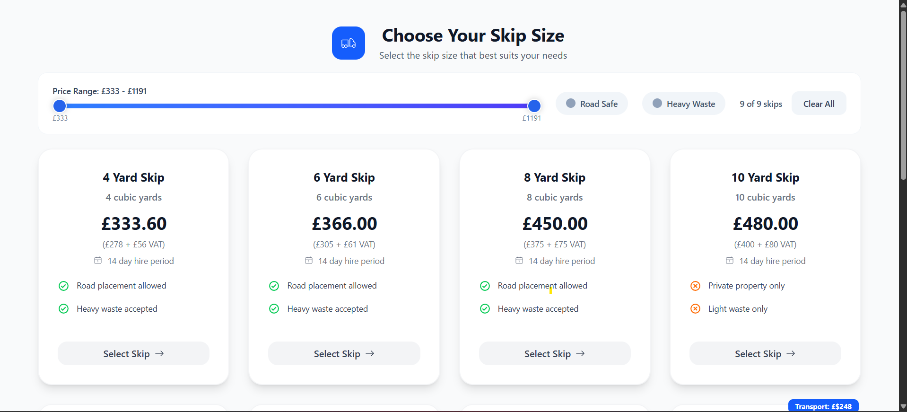
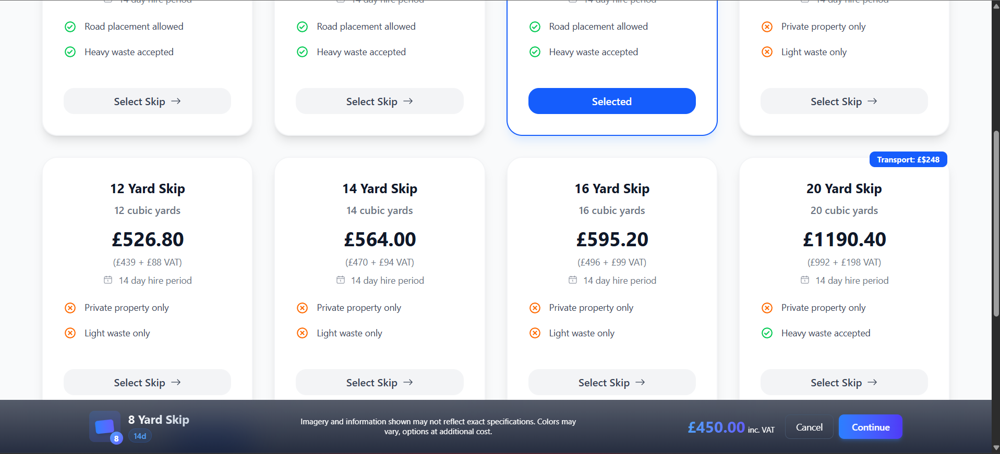
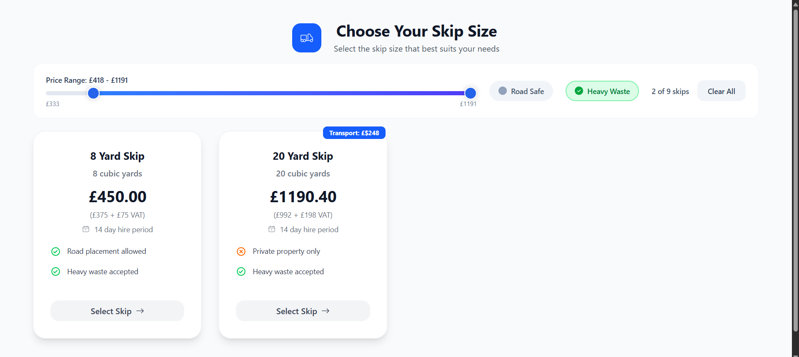
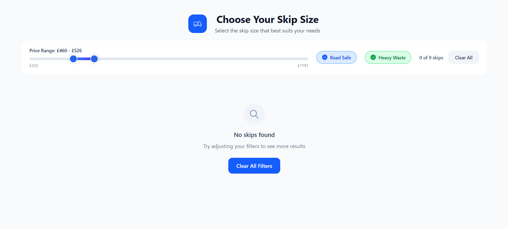

# Business Skip Hiring

This app is a technical assesment for REM Waste campany

## Tech Stack Keys


## Getting Started

### Environment

- [Node.js](https://nodejs.org/) ( v21.1.0)
- [pnpm](https://pnpm.io/) ( v10.11.1 )
- [react](https://img.shields.io/badge/React-20232A?style=for-the-badge&logo=react&logoColor=61DAFB/) ( v19.1.0 )


### Dependencies installation

```sh
pnpm i
```

### Run the application

```sh
pnpm dev
```

# Key Features

- Modular Architecture

- Type Safety: TypeScript throughout with dedicated type directories

- Efficient Styling: Tailwind CSS

- State Management: React Query for server state

- Optimized Build: Vite for fast development and production builds

# Project Architecture

```text
📦 Business Skip Hire
│
├─ public/               # Static assets (favicon, robots.txt, etc.)
├─ src/
│  ├─ components/        # Reusable UI components (buttons, cards, modals)
│  ├─ HOC/               # Higher Order Components (auth, layout wrappers)
│  ├─ providers/         # Application providers
│  ├─ routes/            # Application routing configuration
│  │
│  ├─ pages/             # Page-level components
│  │  ├─ components/     # Page-specific components (not reusable)
│  │  ├─ hooks/          # Custom hooks scoped to this page
│  │  ├─ types/          # Type definitions
│  │  │   ├─ components/ # Component prop types/interfaces
│  │  │   └─ data/       # Data structures and API response types
│  │  ├─ utils/          # Page-specific utility functions
│  │  └─ index.tsx       # Main page component
│  │
│  ├─ App.tsx            # Root component (main layout, providers)
│  └─ main.tsx           # Application entry point
│
├─ node_modules/        # Third-party dependencies (auto-generated)
├─ index.html           # Application HTML template
└─ vite.config.ts       # Vite configuration (build, plugins, etc.)
```
# Project Overview






# Live Demo

Click below to test the project on CodeSandbox:

👉 [Open in CodeSandbox](https://xkmfrs-5173.csb.app/app/skips)